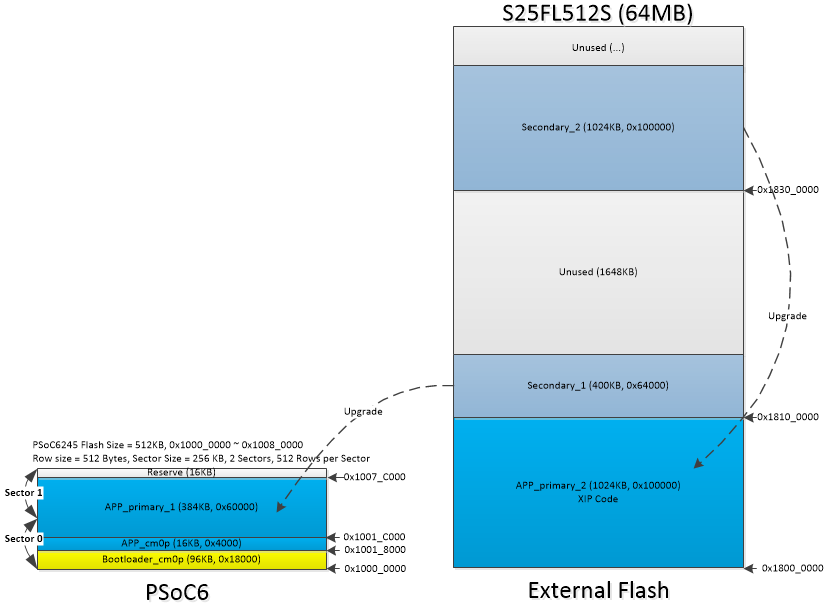
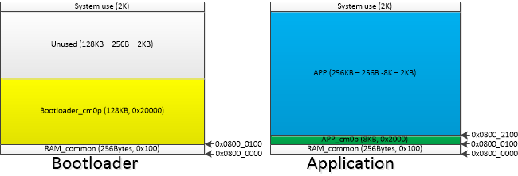
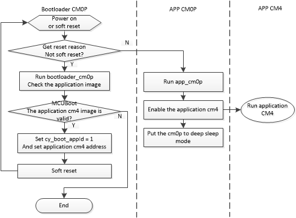
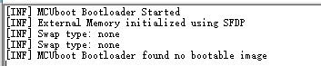
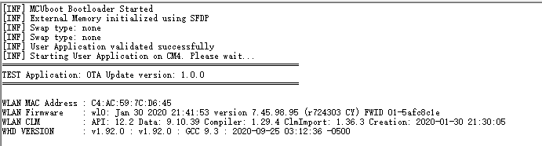
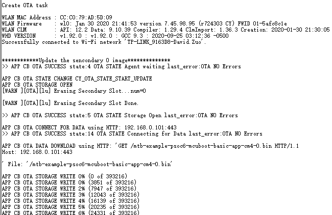
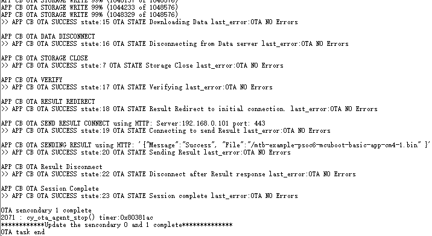
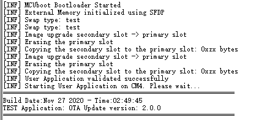

# AnyCloud Example: Over-the-Air Firmware Update Using HTTP With XIP

MCUboot is a secure bootloader for 32-bit MCUs. See [README](https://github.com/cypresssemiconductorco/mtb-example-psoc6-mcuboot-basic/blob/master/README.md) of [mtb-example-psoc6-mcuboot-basic](https://github.com/cypresssemiconductorco/mtb-example-psoc6-mcuboot-basic) code example for more details.

The OTA feature is enabled by the *Over-the-Air update middleware library*. See the [anycloud-ota](https://github.com/cypresssemiconductorco/anycloud-ota) middleware repository on Github for more details.

This example bundles three applications: 

- **bootloader_cm0p app:** Implements an MCUboot-based basic bootloader application run by CM0+. The bootloader handles image authentication and upgrades. When the image is valid, the bootloader set the application address and reset to run.

- **app_cm0p app:** Implements a simple application run by CM0+. 

- **app_cm4 app:** Implements a the OTA application run by CM4. This project demonstrates OTA update with PSoC 6 MCU and CYW43xxx connectivity devices. The device establishes a connection with the designated HTTP/HTTPS server. When the user button was pressed it will create OTA task and be downloaded and written to the secondary slot. On the next reboot, MCUBoot will copy the new image over to the primary slot and run the application. The app_cm4 project based on this exmaple: http://git-ore.aus.cypress.com/wpp/ce/mtb/mtb-example-anycloud-ota-http/-/tree/topic/yekt-v1.0.0-ce-update

   - **BOOT mode:** The application image is built to be programmed into the primary slot. The bootloader will simply boot the application on next reset.
   
   - **UPGRADE mode:** The application image is built to generate the OTA bin files. OTA task will download and write to the secondary slot. The bootloader will copy the image into primary slot and boot it on next reset.


The following is the flash memory layout, it includes bootloader CM0P project, application CM0P project and application CM4 project. The application partition the application into primary1 (run on internal flash) and primary2 (run on the external flash).


**Note:** Make sure the primary 1 and secondary 1 size are the same. The external flash size must be greater than or equal to 4MB.

The following is the ram layout, the first 256 bytes of RAM use to storage the application information, for example: application address. Bootloader CM0P project uses 128K RAM. The application CM0P project uses 8K RAM, system uses 2K RAM, and RAM common 256bytes; the remaining about 245.8K RAM is used by the application CM4 project.


When power on or soft reset, bootloader CM0P project will call Cy_OnResetUser() function in the startup_psoc6_03_cm0plus.S, this function checks the reset reason, if it is not the soft reset, then run the main function of bootloader CM0P, then verify the application CM4 image; if the application CM4 image is valid, set the application ID and address, then soft reset. If it is soft reset, jump to application CM0P project, and enable application CM4. The following is the main flow:




## Requirements

- [ModusToolbox® software](https://www.cypress.com/products/modustoolbox-software-environment) v2.2  
- Board Support Package (BSP) minimum required version: 2.0.0  
- Programming Language: C  
- Associated Parts: All [PSoC® 6 MCU](http://www.cypress.com/PSoC6) parts


## Supported Kits (make variable 'TARGET')

- [PSoC 62S3 Wi-Fi BT Prototyping Kit](https://www.cypress.com/CY8CPROTO-062S3-4343W) (CY8CPROTO-062S3-4343W)


## Hardware Setup

This example uses the board's default configuration. See the kit user guide to ensure that the board is configured correctly.


## Software Setup

- Install a terminal emulator if you don't have one. Instructions in this document use [Tera Term](https://ttssh2.osdn.jp/index.html.en).

- Install a Python Interpreter. This code example is tested with [Python 3.8.3](https://www.python.org/downloads/release/python-383/).

- This examples uses Mongoose to setup a local HTTP server, see section [Setting up HTTP/HTTPS server using Mongoose](#setting-up-httphttps-server-using-mongoose) for more details.


## Using the Code Example

### In Eclipse IDE for ModusToolbox:

1. Click the **New Application** link in the **Quick Panel** (or, use **File** > **New** > **ModusToolbox Application**). This launches the [Project Creator](http://www.cypress.com/ModusToolboxProjectCreator) tool.

2. Pick a kit supported by the code example from the list shown in the **Project Creator - Choose Board Support Package (BSP)** dialog.

   When you select a supported kit, the example is reconfigured automatically to work with the kit. To work with a different supported kit later, use the [Library Manager](https://www.cypress.com/ModusToolboxLibraryManager) to choose the BSP for the supported kit. You can use the Library Manager to select or update the BSP and firmware libraries used in this application. To access the Library Manager, click the link from the Quick Panel. 

   You can also just start the application creation process again and select a different kit.

   If you want to use the application for a kit not listed here, you may need to update the source files. If the kit does not have the required resources, the application may not work.

3. In the **Project Creator - Select Application** dialog, choose the example by enabling the checkbox.

4. Optionally, change the suggested **New Application Name**.

5. Enter the local path in the **Application(s) Root Path** field to indicate where the application needs to be created. 

   Applications that can share libraries can be placed in the same root path.

6. Click **Create** to complete the application creation process.

For more details, see the [Eclipse IDE for ModusToolbox User Guide](https://www.cypress.com/MTBEclipseIDEUserGuide) (locally available at *{ModusToolbox install directory}/ide_{version}/docs/mt_ide_user_guide.pdf*).

### In Command-line Interface (CLI):

ModusToolbox provides the Project Creator as both a GUI tool and a command line tool to easily create one or more ModusToolbox applications. See the "Project Creator Tools" section of the [ModusToolbox User Guide](https://www.cypress.com/ModusToolboxUserGuide) for more details.

Alternatively, you can manually create the application using the following steps.

1. Download and unzip this repository onto your local machine, or clone the repository.

2. Open a CLI terminal and navigate to the application folder.

   On Linux and macOS, you can use any terminal application. On Windows, open the **modus-shell** app from the Start menu.

   **Note:** The cloned application contains a default BSP file (*TARGET_xxx.mtb*) in the *deps* folder. Use the [Library Manager](https://www.cypress.com/ModusToolboxLibraryManager) (`make modlibs` command) to select and download a different BSP file, if required. If the selected kit does not have the required resources or is not [supported](#supported-kits-make-variable-target), the application may not work. 

3. Import the required libraries by executing the `make getlibs` command.

Various CLI tools include a `-h` option that prints help information to the terminal screen about that tool. For more details, see the [ModusToolbox User Guide](https://www.cypress.com/ModusToolboxUserGuide) (locally available at *{ModusToolbox install directory}/docs_{version}/mtb_user_guide.pdf*).

### In Third-party IDEs:

1. Follow the instructions from the [CLI](#in-command-line-interface-cli) section to create the application, and import the libraries using the `make getlibs` command.

2. Export the application to a supported IDE using the `make <ide>` command. 

    For a list of supported IDEs and more details, see the "Exporting to IDEs" section of the [ModusToolbox User Guide](https://www.cypress.com/ModusToolboxUserGuide) (locally available at *{ModusToolbox install directory}/docs_{version}/mtb_user_guide.pdf*.

3. Follow the instructions displayed in the terminal to create or import the application as an IDE project.


## Operation
1. Import the “mtb-anycloud-ota-http-with-xip” to MTB 2.2.
   
   New application -> Select BSP "CY8CPROTO-062S3-4343W" -> Import "mtb-anycloud-ota-http-with-xip" -> click "Create".

2. Modify the external flash sector size to 0x40000 of "bootloader_cm0p" project.
   
   The flash_area_get_sectors() function of bootloader_cm0p\libs\mcuboot\boot\cypress\cy_flash_pal\cy_flash_map.c file.
   
3. Open <bootloader_cm0p>/libs/mcuboot/boot/cypress/MCUBootApp/config/mcuboot_config/mcuboot_config.h* and comment out the following defines to skip checking the image signature and add the MCUBOOT_OVERWRITE_ONLY macro:

   ```
   #define MCUBOOT_SIGN_EC256
   #define NUM_ECC_BYTES (256 / 8)
   .
   .
   /* Uncomment to enable the overwrite-only code path. */
   #define MCUBOOT_OVERWRITE_ONLY
   .
   .
   #define MCUBOOT_VALIDATE_PRIMARY_SLOT
   ```

4. Build and program the "bootloader_cm0p" project.
   
   After programming, the bootloader starts automatically. Confirm that the UART terminal displays a message as shown below:
   

5. Build the application CM0P project: "app_cm0p".

   **Note:** Must build "app_cm0p" project first, then build the "bootloader_cm0p" project.

6. Build and program the application "app_cm4" project in BOOT mode.
   
   Before build, make sure the Makefile of "app_cm4" project is BOOT mode: IMG_TYPE ?= BOOT; change the WIFI SSID and password, and set the HTTP servcer and port in the app_cm4\source\ota_app_config.h file.
   
   **Note:** About the setting up HTTP/HTTPS server using Mongoose, please check http://git-ore.aus.cypress.com/wpp/ce/mtb/mtb-example-anycloud-ota-http/-/blob/topic/yekt-v1.0.0-ce-update/README.md

   After programming, the bootloader starts automatically, lets CM4 run the HTTP OTA application app. Confirm that the OTA update version is 1.0.0 and the UART terminal displays a message as shown below:
   
   
   By default, this code example uses HTTP protocol. Follow the steps below to use HTTPS protocol.
   
      - **Using the Code Example in TLS Mode**:
   
         1. Modify ENABLE_TLS to `true`.
         
         2. Add the Root CA certificate (rootCA.crt) obtained from section [Setting up HTTP/HTTPS server using Mongoose](#setting-up-httphttps-server-using-mongoose) as per the sample shown. 
         
         Note that the Mongoose server doesn't authenticate client through certificate, that is why we don't add the client certificate and client key here. If you use some other server which can do client side authentication, add the client.crt and client.key as well.

7. Build the application CM4 project in UPGRADE mode.
   
   Before build, make sure the Makefile of "app_cm4" project is UPGRADE mode: IMG_TYPE ?= UPGRADE.
   
   After build, generate the bin files for OTA in the app_cm4\build\UPGRADE\app_cm4\CY8CPROTO-062S3-4343W\Debug folder.
   app-fw-0.bin and app-fw-1.bin.
   
8. OTA test.

   Copy the app-fw-0.bin and app-fw-1.bin files to Mongoose directory on the HTTP server host.
   
   Press the SW2 button of CY8CPROTO-062S3-4343W Kit board to trigger the OTA task start, the OTA task will automatically GET the BIN file from the HTTP server, and this task will be automatically deleted after the upgrade is completed.
   
   When the OTA task started, the UART terminal displays a message as shown below:
   
   
   After the file 0 and 1 have been downloaded to external flash complete, the UART terminal displays a message as shown below:
   
   
   After reset, bootloader will automatically copy the upgraded firmware from secondanry area to the primary area and run.
   


## Setting up HTTP/HTTPS server using Mongoose

This code example uses a local server to demonstrate OTA operation over HTTP/HTTPS. [Mongoose](https://cesanta.com/mongoose-library.html) is an embedded web server which is supported on multiple platforms. For windows you can download a stand alone executable which starts the sever on one click. This example uses [*Mongoose v6.5*](https://www.softpedia.com/get/Internet/Servers/WEB-Servers/Mongoose.shtml), all configurations and instructions are applicable only for this version and may not work for other versions. For latest version and support visit [https://www.cesanta.com/mongoose-library.html](https://www.cesanta.com/mongoose-library.html).

1. Download the [*Mongoose v6.5*](https://www.softpedia.com/get/Internet/Servers/WEB-Servers/Mongoose.shtml) executable and place it in a empty folder. This directory where the executable is placed will be called *\<Mongoose Directory>* from now on in this document.

2. Run the executable, a HTTP server is created. A firewall pop up may appear asking to allow or deny Mongoose to communicate on the network. Provide access on private network.

3. A browser will open automatically with the IP address of the server. Note down the IP address without the port number.

4. Copy the Mongoose config file - *\<Application Name>/mongoose_config/mongoose.conf* and paste it in the *\<Mongoose Directory>*.

5. Open a CLI terminal and navigate to *\<Application Name>/scripts/* folder. On Linux and macOS, you can use any terminal application. On Windows, navigate to the modus-shell directory (*{ModusToolbox install directory}/tools_\<version>/modus-shell*) and run *Cygwin.bat*.

6. Execute the following command to generate self-signed SSL certificates and keys:

   ```
   sh generate_ssl_cert.sh <ip-address-noted-in-earlier-step>
   ```

   Example:
   ```
   sh generate_ssl_cert.sh 192.168.0.10
   ```
   
   This step will generate the below files in the same *\<Application Name>/scripts/* directory:

   1. rootCA.crt - Root CA certificate
   2. rootCA.key - Root CA private key
   3. server.pem - SSL certificate for Mongoose
   4. client.crt - Client certificate
   5. client.key - Client private key

7. Copy the *server.pem* file and paste in the *\<Mongoose Directory>*.

8. At this point your *\<Mongoose Directory>* should look something like this:
   
   ```
   <New Folder>
      |
      |--- mongoose-free-6.5.exe
      |--- mongoose.conf
      |--- server.pem
      |
   ```

9. Stop and exit Mongoose server from system tray. Restart the server by running the executable again, now you have a server which accepts both HTTP and HTTPs requests. 


## Debugging

You can debug the example to step through the code. In the IDE, use the **\<Application Name> Debug (KitProg3_MiniProg4)** configuration in the **Quick Panel**. For more details, see the "Program and Debug" section in the [Eclipse IDE for ModusToolbox User Guide](https://www.cypress.com/MTBEclipseIDEUserGuide).

**Note:** **(Only while debugging)** On the CM4 CPU, some code in `main()` may execute before the debugger halts at the beginning of `main()`. This means that some code executes twice - once before the debugger stops execution, and again after the debugger resets the program counter to the beginning of `main()`. See [KBA231071](https://community.cypress.com/docs/DOC-21143) to learn about this and for the workaround.


## Related Resources

| Application Notes                                            |                                                              |
| :----------------------------------------------------------- | :----------------------------------------------------------- |
| [AN228571](https://www.cypress.com/AN228571) – Getting Started with PSoC 6 MCU on ModusToolbox | Describes PSoC 6 MCU devices and how to build your first application with ModusToolbox |
| [AN221774](https://www.cypress.com/AN221774) – Getting Started with PSoC 6 MCU on PSoC Creator | Describes PSoC 6 MCU devices and how to build your first application with PSoC Creator |
| [AN210781](https://www.cypress.com/AN210781) – Getting Started with PSoC 6 MCU with Bluetooth Low Energy (BLE) Connectivity on PSoC Creator | Describes PSoC 6 MCU with BLE Connectivity devices and how to build your first application with PSoC Creator |
| [AN215656](https://www.cypress.com/AN215656) – PSoC 6 MCU: Dual-CPU System Design | Describes the dual-CPU architecture in PSoC 6 MCU, and shows how to build a simple dual-CPU design |
| **Code Examples**                                            |                                                              |
| [Using ModusToolbox](https://github.com/cypresssemiconductorco/Code-Examples-for-ModusToolbox-Software) | [Using PSoC Creator](https://www.cypress.com/documentation/code-examples/psoc-6-mcu-code-examples) |
| **Device Documentation**                                     |                                                              |
| [PSoC 6 MCU Datasheets](https://www.cypress.com/search/all?f[0]=meta_type%3Atechnical_documents&f[1]=resource_meta_type%3A575&f[2]=field_related_products%3A114026) | [PSoC 6 Technical Reference Manuals](https://www.cypress.com/search/all/PSoC%206%20Technical%20Reference%20Manual?f[0]=meta_type%3Atechnical_documents&f[1]=resource_meta_type%3A583) |
| **Development Kits**                                         | Buy at www.cypress.com                                       |
| [CY8CKIT-062-BLE](https://www.cypress.com/CY8CKIT-062-BLE) PSoC 6 BLE Pioneer Kit | [CY8CKIT-062-WiFi-BT](https://www.cypress.com/CY8CKIT-062-WiFi-BT) PSoC 6 WiFi-BT Pioneer Kit |
| [CY8CPROTO-063-BLE](https://www.cypress.com/CY8CPROTO-063-BLE) PSoC 6 BLE Prototyping Kit | [CY8CPROTO-062-4343W](https://www.cypress.com/CY8CPROTO-062-4343W) PSoC 6 Wi-Fi BT Prototyping Kit |
| [CY8CKIT-062S2-43012](https://www.cypress.com/CY8CKIT-062S2-43012) PSoC 62S2 Wi-Fi BT Pioneer Kit | [CY8CPROTO-062S3-4343W](https://www.cypress.com/CY8CPROTO-062S3-4343W) PSoC 62S3 Wi-Fi BT Prototyping Kit |
| [CYW9P62S1-43438EVB-01](https://www.cypress.com/CYW9P62S1-43438EVB-01) PSoC 62S1 Wi-Fi BT Pioneer Kit | [CYW9P62S1-43012EVB-01](https://www.cypress.com/CYW9P62S1-43012EVB-01) PSoC 62S1 Wi-Fi BT Pioneer Kit |                                                              |
|[CY8CKIT-064B0S2-4343W](http://www.cypress.com/CY8CKIT-064B0S2-4343W) PSoC 64 Secure Boot Wi-Fi BT Pioneer Kit|  |                                                              |
| **Libraries**                                                 |                                                              |
| PSoC 6 Peripheral Driver Library (PDL) and docs  | [mtb-pdl-cat1](https://github.com/cypresssemiconductorco/mtb-pdl-cat1) on GitHub |
| Cypress Hardware Abstraction Layer (HAL) Library and docs     | [mtb-hal-cat1](https://github.com/cypresssemiconductorco/mtb-hal-cat1) on GitHub |
| Retarget IO - A utility library to retarget the standard input/output (STDIO) messages to a UART port | [retarget-io](https://github.com/cypresssemiconductorco/retarget-io) on GitHub |
| **Middleware**                                               |                                                              ||                                                              |
| AnyCloud OTA library and docs                                | [anycloud-ota](https://github.com/cypresssemiconductorco/anycloud-ota) on GitHub |
| Wi-Fi Middleware Core library and docs                       | [wifi-mw-core](https://github.com/cypresssemiconductorco/wifi-mw-core) on GitHub |
| CapSense® library and docs                                    | [capsense](https://github.com/cypresssemiconductorco/capsense) on GitHub |
| Links to all PSoC 6 MCU Middleware                           | [psoc6-middleware](https://github.com/cypresssemiconductorco/psoc6-middleware) on GitHub |
| **Tools**                                                    |                                                              |
| [Eclipse IDE for ModusToolbox](https://www.cypress.com/modustoolbox)     | The cross-platform, Eclipse-based IDE for IoT designers that supports application configuration and development targeting converged MCU and wireless systems.             |
| [PSoC Creator™](https://www.cypress.com/products/psoc-creator-integrated-design-environment-ide) | The Cypress IDE for PSoC and FM0+ MCU development.            |

## Other Resources

Cypress provides a wealth of data at www.cypress.com to help you select the right device, and quickly and effectively integrate it into your design.

For PSoC 6 MCU devices, see [How to Design with PSoC 6 MCU - KBA223067](https://community.cypress.com/docs/DOC-14644) in the Cypress community.

## Document History

Document Title: *CE231585* - *AnyCloud Example: Over-the-Air Firmware Update Using HTTP*

| Version | Description of Change |
| ------- | --------------------- |
| 1.0.0   | New code example      |
------

All other trademarks or registered trademarks referenced herein are the property of their respective owners.


-------------------------------------------------------------------------------

© Cypress Semiconductor Corporation, 2020. This document is the property of Cypress Semiconductor Corporation and its subsidiaries ("Cypress"). This document, including any software or firmware included or referenced in this document ("Software"), is owned by Cypress under the intellectual property laws and treaties of the United States and other countries worldwide. Cypress reserves all rights under such laws and treaties and does not, except as specifically stated in this paragraph, grant any license under its patents, copyrights, trademarks, or other intellectual property rights. If the Software is not accompanied by a license agreement and you do not otherwise have a written agreement with Cypress governing the use of the Software, then Cypress hereby grants you a personal, non-exclusive, nontransferable license (without the right to sublicense) (1) under its copyright rights in the Software (a) for Software provided in source code form, to modify and reproduce the Software solely for use with Cypress hardware products, only internally within your organization, and (b) to distribute the Software in binary code form externally to end users (either directly or indirectly through resellers and distributors), solely for use on Cypress hardware product units, and (2) under those claims of Cypress's patents that are infringed by the Software (as provided by Cypress, unmodified) to make, use, distribute, and import the Software solely for use with Cypress hardware products. Any other use, reproduction, modification, translation, or compilation of the Software is prohibited.  
TO THE EXTENT PERMITTED BY APPLICABLE LAW, CYPRESS MAKES NO WARRANTY OF ANY KIND, EXPRESS OR IMPLIED, WITH REGARD TO THIS DOCUMENT OR ANY SOFTWARE OR ACCOMPANYING HARDWARE, INCLUDING, BUT NOT LIMITED TO, THE IMPLIED WARRANTIES OF MERCHANTABILITY AND FITNESS FOR A PARTICULAR PURPOSE. No computing device can be absolutely secure. Therefore, despite security measures implemented in Cypress hardware or software products, Cypress shall have no liability arising out of any security breach, such as unauthorized access to or use of a Cypress product. CYPRESS DOES NOT REPRESENT, WARRANT, OR GUARANTEE THAT CYPRESS PRODUCTS, OR SYSTEMS CREATED USING CYPRESS PRODUCTS, WILL BE FREE FROM CORRUPTION, ATTACK, VIRUSES, INTERFERENCE, HACKING, DATA LOSS OR THEFT, OR OTHER SECURITY INTRUSION (collectively, "Security Breach"). Cypress disclaims any liability relating to any Security Breach, and you shall and hereby do release Cypress from any claim, damage, or other liability arising from any Security Breach. In addition, the products described in these materials may contain design defects or errors known as errata which may cause the product to deviate from published specifications. To the extent permitted by applicable law, Cypress reserves the right to make changes to this document without further notice. Cypress does not assume any liability arising out of the application or use of any product or circuit described in this document. Any information provided in this document, including any sample design information or programming code, is provided only for reference purposes. It is the responsibility of the user of this document to properly design, program, and test the functionality and safety of any application made of this information and any resulting product. "High-Risk Device" means any device or system whose failure could cause personal injury, death, or property damage. Examples of High-Risk Devices are weapons, nuclear installations, surgical implants, and other medical devices. "Critical Component" means any component of a High-Risk Device whose failure to perform can be reasonably expected to cause, directly or indirectly, the failure of the High-Risk Device, or to affect its safety or effectiveness. Cypress is not liable, in whole or in part, and you shall and hereby do release Cypress from any claim, damage, or other liability arising from any use of a Cypress product as a Critical Component in a High-Risk Device. You shall indemnify and hold Cypress, its directors, officers, employees, agents, affiliates, distributors, and assigns harmless from and against all claims, costs, damages, and expenses, arising out of any claim, including claims for product liability, personal injury or death, or property damage arising from any use of a Cypress product as a Critical Component in a High-Risk Device. Cypress products are not intended or authorized for use as a Critical Component in any High-Risk Device except to the limited extent that (i) Cypress's published data sheet for the product explicitly states Cypress has qualified the product for use in a specific High-Risk Device, or (ii) Cypress has given you advance written authorization to use the product as a Critical Component in the specific High-Risk Device and you have signed a separate indemnification agreement.  
Cypress, the Cypress logo, Spansion, the Spansion logo, and combinations thereof, WICED, PSoC, CapSense, EZ-USB, F-RAM, and Traveo are trademarks or registered trademarks of Cypress in the United States and other countries. For a more complete list of Cypress trademarks, visit cypress.com. Other names and brands may be claimed as property of their respective owners.
